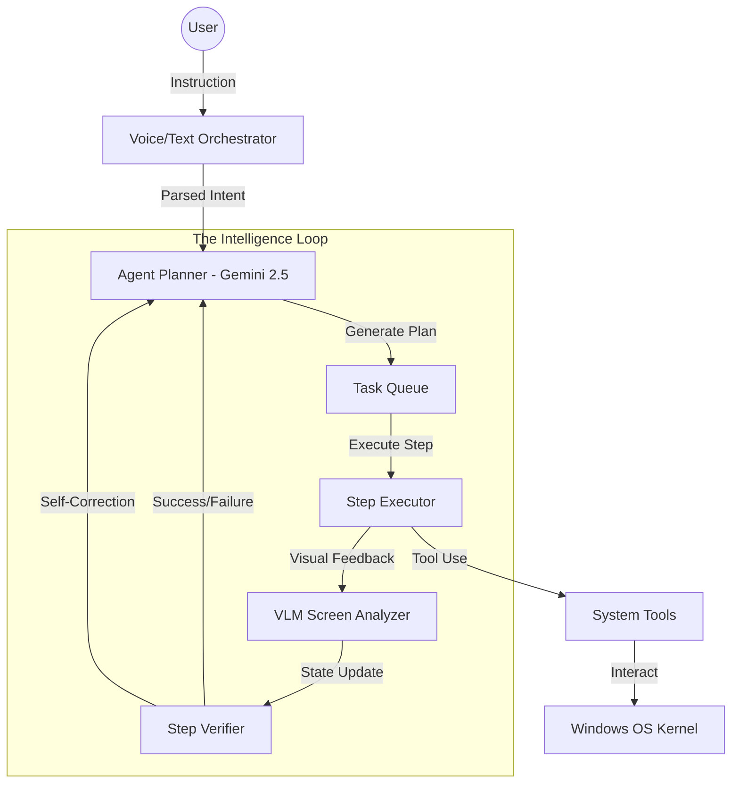
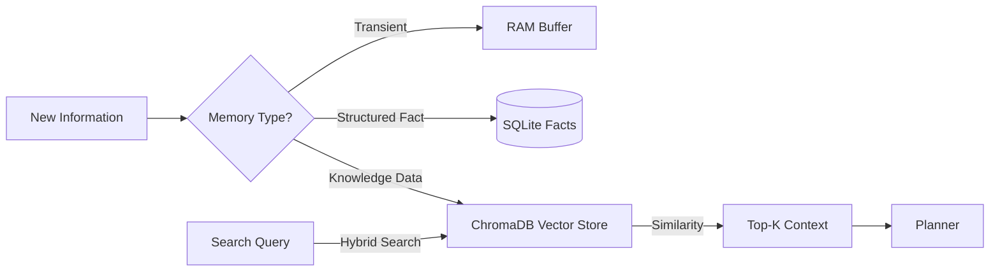
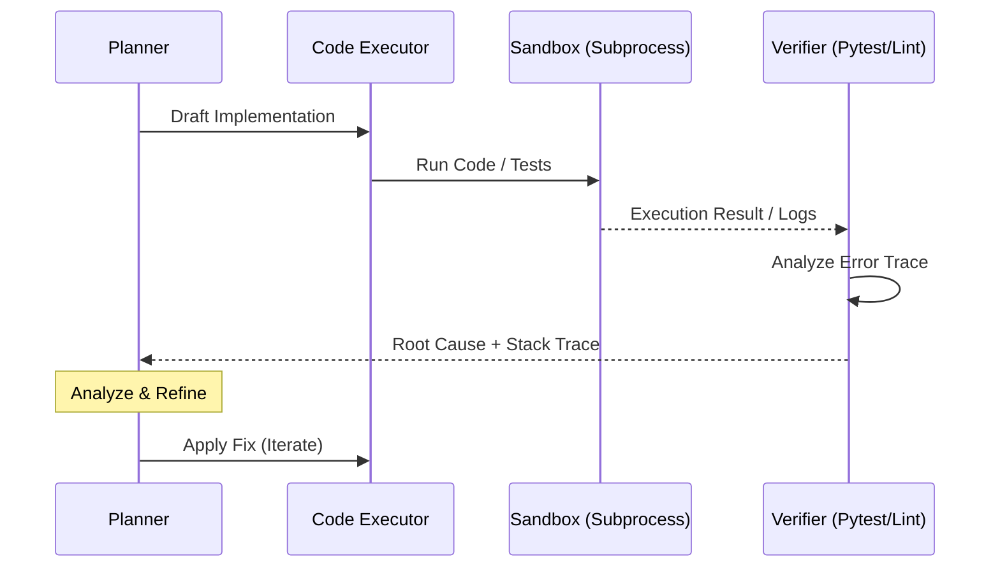

# 🤖 B.U.D.D.Y-Mark-67 // PROTOCOL SIRIUS
### The Ultimate Autonomous Personal AI Operating System

[](LICENSE)
[](https://www.python.org/)
[]()
[]()

**B.U.D.D.Y (Biometric Utility & Digital Desktop Yield) Mark LXVII** is a production-grade autonomous agent built to serve as a native OS kernel. Unlike traditional chatbots, SIRIUS/BUDDY possesses **Vision-Language Model (VLM) Autonomy**, allowing it to see, reason, and interact with any desktop application just like a human operator.

---

## 🌌 Core Capabilities

- **👁️ VLM Autonomy**: Uses Gemini 2.5 Vision and local multimodal models to understand screen content semantically.
- **🧠 RAG Intelligence**: Real-time indexing of your local documents (.pdf, .docx, .py, .md) using ChromaDB for hyper-personalized context.
- **🎙️ Neural Voice Engine**: Dual-stream voice routing with Sarvam AI (primary) and Gemini (fallback), featuring low-latency Bulbul v3 TTS.
- **🛡️ Security Suite**: Integrated firewall management, process shielding, and system-wide security auditing.
- **🌐 Dynamic Browser**: Autonomous web research and workflow execution via a self-healing Playwright engine.
- **🧑‍💻 Developer Nexus**: A full-scale coding agent capable of writing, executing, and debugging code in a local sandbox.
- **📱 Telegram Bridge**: Full remote control of your OS via a secure, encrypted Telegram bot with voice support.

---

## 🏗️ Deep Engineering & Architecture

### 1. The Autonomous Intelligence Kernel
The "Brain" of BUDDY is built on a non-linear planning architecture. Instead of simple instruction following, the kernel operates in an **Observe-Plan-Execute-Verify** loop.



### 2. VLM Semantic Vision Mapping
BUDDY doesn't just see pixels; it understands the "Semantic DOM" of a Windows desktop. Using a combination of high-frequency screen captures and Gemini 2.5 Vision, the system maps UI elements to logical actions.

- **Semantic Mapping**: Identifying that a "Red X" at the top right is a "Close Window" intent, regardless of the application.
- **Visual Grounding**: Correlating coordinates with text labels discovered via OCR and semantic reasoning.
- **Real-time Monitoring**: Detecting state changes (e.g., a loading spinner disappearing) to trigger the next execution step.

### 3. Hybrid Memory Engine (RAG + SQLite)
Memory is handled in three distinct layers to balance speed, precision, and long-term retention.

| Memory Type | Implementation | Purpose |
|---|---|---|
| **Short-term** | In-memory Buffer | Current conversation context and task state. |
| **Mid-term** | SQLite Database | Facts about the user, system settings, and task history. |
| **Long-term (RAG)** | ChromaDB + Sentence Transformers | Semantic retrieval of local documents and codebase knowledge. |



---

## 🧑‍💻 The Autonomous Developer Agent
One of the most advanced subsystems in Mark LXVII is the **Autonomous Developer Engine**. It is designed to maintain itself and solve user-requested coding tasks.

### Self-Correction & Debugging Flow
When BUDDY encounters a code error or is asked to implement a feature, it enters a "Sandbox Execution" mode.



---

## 🛡️ Security Framework: The Sirius Shield
Security is integrated at the kernel level. BUDDY monitors its own environment and the host system.

- **Process Shielding**: Monitors for unauthorized attempts to terminate BUDDY processes.
- **Firewall Orchestration**: Dynamically opens/closes ports required for browser automation and remote control.
- **System Audit**: Scans for vulnerabilities, open shares, and insecure configurations using integrated security scripts.
- **Encrypted Vault**: All API keys and secrets are stored in an AES-256 encrypted vault, never exposed in logs or UI.

---

## 🎙️ Neural Voice Routing
BUDDY uses a high-performance voice routing engine to ensure human-like interaction with zero perceived lag.

- **Primary Route**: **Sarvam AI (Bulbul v3)** for ultra-fast, high-fidelity Indian-accented speech.
- **Fallback Route**: **Gemini 2.5 TTS** for multilingual support and high-reliability backup.
- **Voice-to-Task**: Real-time STT streaming that triggers the intent analyzer before the user even finishes speaking.

---

## 🌐 Dynamic Browser & Web Automation
The web engine is built on **Playwright**, but enhanced with autonomous logic.

- **Self-Healing Selectors**: If a button's ID changes, BUDDY uses semantic vision to find it by text, position, or icon.
- **Cookie & Session Management**: Securely handles logins across multiple browsing sessions.
- **Content Extraction**: Automatically strips ads and noise, extracting clean markdown for the LLM to process.

---

## 🛠️ Technical Stack & Library Roles

| Library | Role | Why it's used |
|---|---|---|
| `google-genai` | **Primary Brain** | State-of-the-art reasoning and vision capabilities. |
| `chromadb` | **Vector DB** | Local-first, high-performance RAG storage. |
| `sentence-transformers` | **Embedding Engine** | Generating vectors without cloud dependency. |
| `playwright` | **Browser Kernel** | Industrial-grade web automation. |
| `pywinauto` / `pyautogui` | **OS Interfacing** | Controlling the Windows desktop environment. |
| `PyQt6` | **GUI Layer** | Hardware-accelerated, holographic dashboard. |
| `sarvam` | **Neural Audio** | Best-in-class low-latency voice synthesis. |
| `opencv-python` | **Computer Vision** | Low-level image processing and motion detection. |
| `mss` | **Screen Grabber** | Ultra-fast cross-platform screenshot utility. |
| `psutil` | **System Metrics** | Monitoring CPU, RAM, and network health. |

---

## 🚀 Installation & Deployment

### 1. The Setup Wizard (Recommended)
BUDDY includes an automated setup script that handles local model pulling (Ollama) and browser engine initialization.

```bash
python setup_buddy.py
```

### 2. Manual Configuration
Ensure you have Python 3.10+ and FFmpeg installed.

```bash
pip install -r requirements.txt
python -m playwright install
```

---

## ⚙️ Configuration (.env)

Create a `.env` file in the root directory:

```env
# Core Intelligence
BUDDY_GEMINI_API_KEY=your_key_here

# Voice Routing (Sarvam AI)
SARVAM_API_KEYS=key1,key2,key3
SARVAM_TTS_MODEL=bulbul:v3
SARVAM_TTS_SPEAKER=Ritu

# Remote Control
TELEGRAM_BOT_TOKEN=your_bot_token
TELEGRAM_USER_ID=your_chat_id

# System Environment
BUDDY_OS=windows
BUDDY_LOG_LEVEL=INFO
```

---

## 📜 License

This project is licensed under the **Sirius Proprietary & Personal Use License**. 
- **Personal Use**: Permitted for individual non-commercial use.
- **Distribution**: Unauthorized distribution, sub-licensing, or resale is strictly prohibited.
- **Modification**: Permitted for personal use only; modified versions cannot be distributed.

---

## 👤 Credits

**Lead Architect**: Sirius  
*Building the future of autonomous personal computing.*

⭐ **Star this repository if you believe in autonomous desktop agents.**

---

### 📡 Data Privacy Policy
BUDDY is designed to be local-first. While cloud LLMs are used for high-level reasoning, your local documents indexed via RAG **never leave your machine**. Only specific snippets relevant to a query are sent to the LLM to provide context, ensuring maximum privacy for your personal data.
