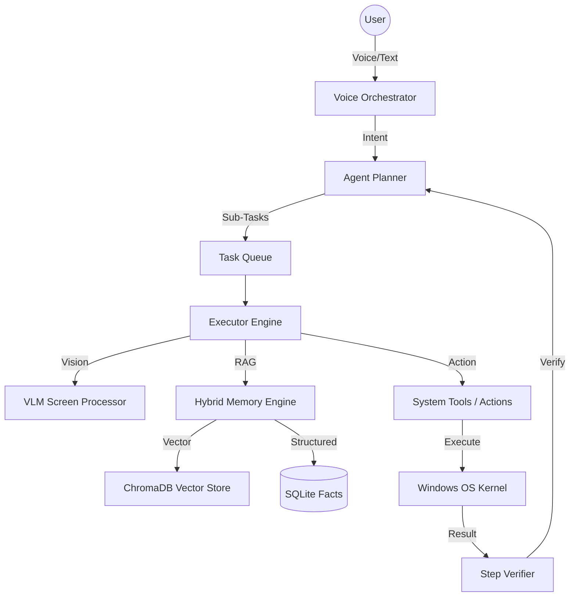
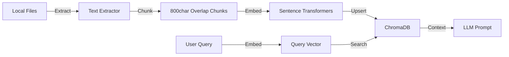

# 🤖 B.U.D.D.Y-Mark-67 // PROTOCOL SIRIUS
### The Ultimate Autonomous Personal AI Operating System

[](LICENSE)
[](https://www.python.org/)
[]()

**B.U.D.D.Y (Biometric Utility & Digital Desktop Yield) Mark LXVII** is a production-grade autonomous agent built to serve as a native OS kernel. Unlike traditional chatbots, SIRIUS/BUDDY possesses **Vision-Language Model (VLM) Autonomy**, allowing it to see, reason, and interact with any desktop application just like a human operator.

---

## 🌌 Core Capabilities

- **👁️ VLM Autonomy**: Uses Gemini 2.5 Vision and local multimodal models to understand screen content semantically.
- **🧠 RAG Intelligence**: Real-time indexing of your local documents (.pdf, .docx, .py, .md) using ChromaDB for hyper-personalized context.
- **🎙️ Neural Voice Engine**: Dual-stream voice routing with Sarvam AI (primary) and Gemini (fallback), featuring low-latency Bulbul v3 TTS.
- **🛡️ Security Suite**: Integrated firewall management, process shielding, and system-wide security auditing.
- **🌐 Dynamic Browser**: Autonomous web research and workflow execution via a self-healing Playwright engine.
- **🧑‍💻 Developer Nexus**: A full-scale coding agent capable of writing, executing, and debugging code in a local sandbox.
- **📱 Telegram Bridge**: Full remote control of your OS via a secure, encrypted Telegram bot with voice support.

---

## 📐 System Architecture

### Intelligence Workflow


### RAG Strategy (Local Data Retrieval)


---

## 🛠️ Technical Stack & Dependencies

| Library | Role | Capability |
|---|---|---|
| `google-genai` | **Cloud Brain** | Gemini 2.5 Flash for planning, vision, and fallback voice. |
| `chromadb` | **Vector Storage** | Persistent vector database for RAG and long-term memory. |
| `sentence-transformers` | **Embeddings** | Local generation of high-dimensional text vectors. |
| `playwright` | **Web Engine** | Headless/Headful browser automation and scraping. |
| `pywinauto` / `pyautogui` | **OS Control** | Direct manipulation of Windows GUI and inputs. |
| `PyQt6` | **Dashboard** | High-performance hardware-accelerated UI. |
| `sarvam` | **Neural Voice** | High-fidelity Indian-accented TTS and STT. |
| `opencv-python` | **Vision** | Frame analysis and screen processing. |
| `python-telegram-bot` | **Remote Link** | Secure mobile-to-desktop control bridge. |

---

## 🚀 Installation & Deployment

### 1. The Setup Wizard (Recommended)
BUDDY includes an automated setup script that handles local model pulling (Ollama) and browser engine initialization.

```bash
python setup_buddy.py
```

### 2. Manual Configuration
Ensure you have Python 3.10+ and FFmpeg installed.

```bash
pip install -r requirements.txt
python -m playwright install
```

---

## ⚙️ Configuration (.env)

Create a `.env` file in the root directory:

```env
# Core Intelligence
BUDDY_GEMINI_API_KEY=your_key_here

# Voice Routing (Sarvam AI)
SARVAM_API_KEYS=key1,key2,key3
SARVAM_TTS_MODEL=bulbul:v3
SARVAM_TTS_SPEAKER=Ritu

# Remote Control
TELEGRAM_BOT_TOKEN=your_bot_token
TELEGRAM_USER_ID=your_chat_id

# System Environment
BUDDY_OS=windows
BUDDY_LOG_LEVEL=INFO
```

---

## 📜 License

This project is licensed under the **Sirius Proprietary & Personal Use License**. 
- **Personal Use**: Permitted for individual non-commercial use.
- **Distribution**: Unauthorized distribution, sub-licensing, or resale is strictly prohibited.
- **Modification**: Permitted for personal use only; modified versions cannot be distributed.

---

## 👤 Credits

**Lead Architect**: Sirius  
*Building the future of autonomous personal computing.*

⭐ **Star this repository if you believe in autonomous desktop agents.**
