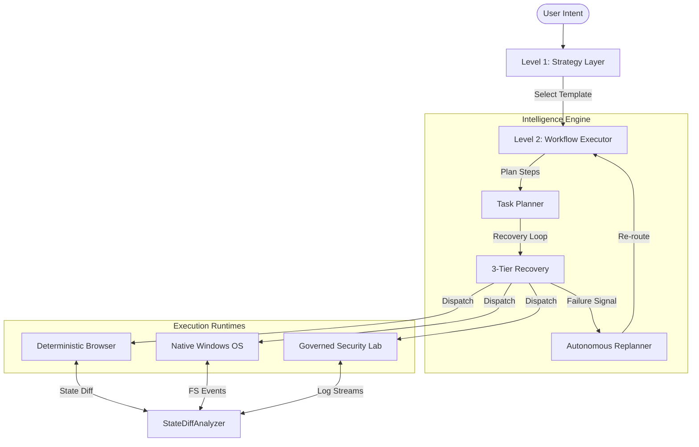
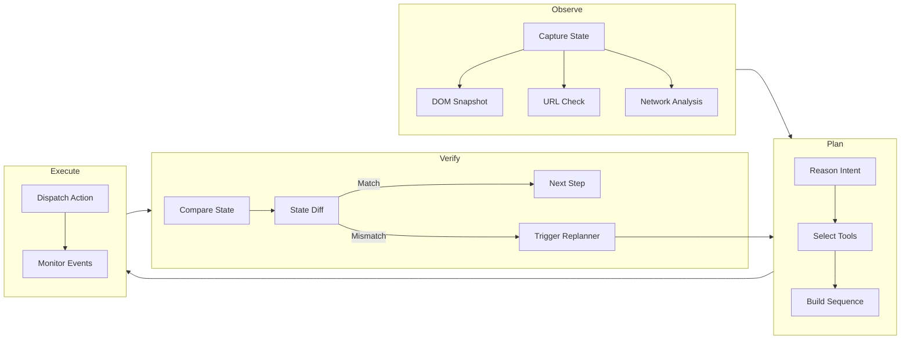
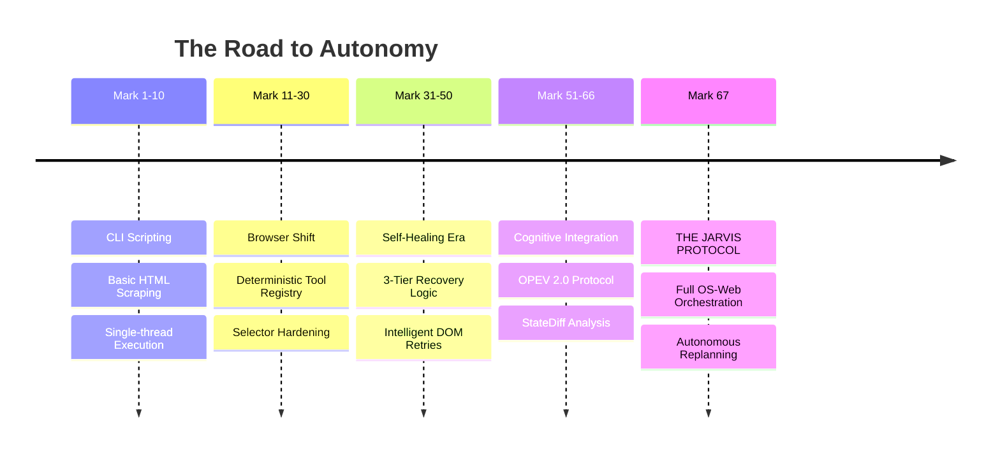

<div align="center">


# B.U.D.D.Y — Mark 67

### The Autonomous AI OS Operator

<p>
  
  
  
  
  
</p>

B.U.D.D.Y is an autonomous agent that bridges the gap between human intent and operating system execution.  
It does not chat. It **acts, verifies, and replans** — across both the web and your local environment.

**Built by [Sirius](https://github.com/Sirius6907)**

</div>

---

## Table of Contents

- [Quick Start](#-quick-start)
- [Vision](#-vision)
- [The JARVIS Protocol](#-the-jarvis-protocol)
- [System Architecture](#-system-architecture)
- [The OPEV 2.0 Lifecycle](#-the-opev-20-lifecycle)
- [Browser Engine — 443 Deterministic Actions](#-browser-engine--443-deterministic-actions)
- [Self-Healing Recovery](#-self-healing-recovery)
- [OS-Web Orchestration](#-os-web-orchestration)
- [What B.U.D.D.Y Can Do](#-what-buddy-can-do)
- [State Verification](#-state-verification)
- [Strategy Library](#-strategy-library)
- [Testing & Reliability](#-testing--reliability)
- [Safety & Governance](#-safety--governance)
- [Extending B.U.D.D.Y](#-extending-buddy)
- [Evolution of the Mark Series](#-evolution-of-the-mark-series)
- [Technical Specifications](#-technical-specifications)
- [Roadmap](#-roadmap)
- [FAQ](#-faq)
- [Contributing](#-contributing)

---

## 📂 Quick Start

### Prerequisites

| Requirement | Version |
|---|---|
| **OS** | Windows 10 / 11 |
| **Python** | 3.12+ |
| **Browser Runtime** | Playwright (installed automatically) |

### Installation

```powershell
git clone https://github.com/Sirius6907/B.U.D.D.Y-Mark-67.git
cd B.U.D.D.Y-Mark-67

# Automated setup — installs dependencies, Playwright browsers, and validates the environment
.\setup.ps1
```

### Configuration

Create a `.env` file in the project root:

```env
BUDDY_GEMINI_API_KEY=your_key_here   # Vision & fallback reasoning
OPENROUTER_API_KEY=your_key_here     # High-level planning
```

> Both keys are stored locally and are **never** transmitted externally.

---

## 🚀 Vision

Today's AI can think and explain, but it cannot truly **act**.

There is a fundamental gap between what humans want done and what computers actually execute. That gap forces users to switch between tools, perform repetitive actions manually, and translate intent into mechanical steps.

**B.U.D.D.Y exists to eliminate that gap.**

The goal is not a smarter chatbot. The goal is an AI that can operate a computer the way a skilled human does — only faster, more precise, and more reliable.

> *From "AI that tells you what to do" → to "AI that does it for you."*

### What "Operate Like a Human" Means

A human at a computer opens applications, browses the web, clicks, types, scrolls, understands context, recovers from mistakes, and chains multi-step tasks together. B.U.D.D.Y replicates every one of those capabilities through four layers:

| Human Capability | B.U.D.D.Y Equivalent |
|---|---|
| Perceive the screen | **Strategy Layer** — structured reasoning over DOM, URL, and network state |
| Decide what to do | **Workflow Executor** — deterministic tool selection from 443 actions |
| Perform the action | **Execution Runtime** — sub-millisecond dispatches via Playwright & Win32 |
| Confirm it worked | **StateDiffAnalyzer** — 4-dimensional before/after verification |
| Recover from errors | **3-Tier Recovery Engine** — retry → fallback → autonomous replanning |

### Core Philosophy

> Intelligence is not enough. Real power comes from **Execution + Verification + Adaptation**.

We are building the next layer of Human-Computer Interaction — a future where computers are not tools you operate, but agents you collaborate with. B.U.D.D.Y is the first step toward that reality.

---

## 🌩️ The JARVIS Protocol

**B.U.D.D.Y (Mark 67)** was born from a single vision: to move beyond chatbots and build a true **JARVIS-like system** — an autonomous digital entity that doesn't just suggest, but *executes*.

The Mark series naming convention reflects iterative, high-fidelity engineering. Each Mark represents a leap in cognitive orchestration and operational reliability. The JARVIS Protocol is the architectural philosophy that governs Mark 67, built on three pillars:

### 1. Direct Cognitive Abstraction

We skip the GUI interpretation layer. Instead of looking at a screen and guessing what a button does, B.U.D.D.Y maps the internal state of the application directly — speaking the language of the OS and the DOM rather than interpreting pixels.

### 2. The Verification Mandate

An action without verification is a hallucination. Every state change must be observed, diffed, and validated against the original intent before the next step is even planned.

### 3. Predictive Replanning

Instead of failing when a path is blocked, the protocol anticipates bottlenecks. If a Tier 2 fallback is likely, the agent pre-warms the logic for that fallback, enabling near-instantaneous recovery.

---

## 🏛 System Architecture

B.U.D.D.Y operates on a 4-layer hierarchy that separates high-level reasoning from low-level action:



**Layer 1 — Strategy Layer (Intent Mapping)**  
The system doesn't start with raw tools. It starts with intent analysis. When you say *"Search for X and compare with Y,"* the Strategy Layer selects a pre-validated workflow template (e.g., `MULTI_TAB_COMPARE`), giving the agent a mental map before the first click.

**Layer 2 — Workflow Executor (OPEV 2.0)**  
The recursive Observe-Plan-Execute-Verify loop that governs every action cycle.

**Layer 3 — Execution Runtimes**  
Three isolated runtimes — Browser (Playwright), Desktop (Win32/PowerShell), and Security Lab (governed Kali tools) — each with deterministic, typed interfaces.

**Layer 4 — State Verification**  
The `StateDiffAnalyzer` closes the loop by comparing pre- and post-action state across four dimensions: URL, DOM tree hash, network activity, and page content.

---

## 🔄 The OPEV 2.0 Lifecycle

The core of B.U.D.D.Y's intelligence is the **Observe → Plan → Execute → Verify** cycle. Unlike linear scripts, this is a recursive loop that self-corrects based on real-time feedback.



| Phase | What Happens |
|---|---|
| **Observe** | Capture 4-dimensional state — DOM structure, current URL, active forms, and viewport contents. |
| **Plan** | Resolve strategy steps into the most reliable tools from the 443-action registry. |
| **Execute** | Dispatch deterministic actions with sub-millisecond precision. |
| **Verify** | Use the `StateDiffAnalyzer` to confirm the environment changed as expected. On mismatch, trigger the Replanner. |

---

## 🌐 Browser Engine — 443 Deterministic Actions

B.U.D.D.Y treats the web as a structured API, not a series of images. The registry contains 443 specialized, strictly-typed tools across 9 domains:

| Domain | Actions | Purpose |
|---|---|---|
| `browser_auth` | 38 | Auth flows, SSO handshakes, session persistence |
| `browser_dom` | 124 | Shadow DOM, ARIA roles, dynamic element interaction |
| `browser_extract` | 82 | Structured data collection, table parsing, multi-tab scraping |
| `browser_nav` | 45 | Domain-aware routing, history management, stealth navigation |
| `browser_input` | 64 | Form-filling, drag-and-drop, keyboard/mouse emulation |
| `browser_tab` | 30 | Multi-context orchestration, cross-tab data sync |
| `browser_wait` | 20 | State-aware synchronization (network idle, element visibility) |
| `browser_js` | 25 | JavaScript injection for edge-case recovery |
| `browser_state` | 15 | State snapshotting and diffing for verification |

Every action is a typed Python function with Pydantic-validated inputs, structured outputs, and built-in error contracts.

---

## 🛡️ Self-Healing Recovery

Traditional agents fail when a popup appears or a selector changes. B.U.D.D.Y heals itself through a 3-tier escalation protocol:

### Tier 1 — Intelligent Retry

Auto-waits for DOM stabilization, re-selects elements with increased timeout, and retries with aggressive polling. Handles transient network hiccups and element load delays.

### Tier 2 — Fallback Strategy

Switches implementation methods entirely. If `browser_dom_click_element` fails due to an overlay, B.U.D.D.Y falls back to `browser_js_execute_javascript` to trigger the click event directly on the DOM node.

### Tier 3 — Autonomous Replanning

When a step is unrecoverable, the Replanner engine analyzes the error and modifies the workflow:

| Operation | Description |
|---|---|
| **INSERT** | Add preparatory steps — scroll into view, dismiss a popup, wait for animation |
| **REPLACE** | Swap the failed tool for a different logical approach |
| **REDUCE** | Simplify the goal to preserve the overall mission |

---

## 🖥️ OS-Web Orchestration

The true power of B.U.D.D.Y is crossing the boundary between browser and local machine in a single workflow:

- **Dev Automation** — Research a library online → download documentation → initialize a local repo → scaffold boilerplate code.
- **Local RAG Pipelines** — Scrape 50 articles → vectorize locally in ChromaDB → answer queries using web-sourced context.
- **DevOps Autonomy** — Monitor a live web-app status → if it's down, check local Docker logs → restart containers → verify recovery.

---

## 🎯 What B.U.D.D.Y Can Do

These are real-world prompts at maximum complexity — the kind of tasks that separate an autonomous operator from a chatbot.

### Browser Operations

| # | Prompt |
|---|---|
| 1 | *"Research the top 5 AI coding models, extract pricing tables from 5 sites, and generate a comparison CSV."* |
| 2 | *"Login to my GitHub, find the repo with the most open issues, and summarize the top 3 critical bugs."* |
| 3 | *"Navigate to a flight booking site, find the cheapest NYC → London flight for next week, and screenshot the checkout page."* |
| 4 | *"Crawl a documentation site, find all broken internal links, and report them in structured JSON."* |
| 5 | *"Login to a SaaS dashboard, navigate to Billing, and download the last 3 invoices as PDFs."* |

### Cross-Environment Operations (Browser + OS)

| # | Prompt |
|---|---|
| 6 | *"Research FastAPI best practices, then create a local `api_project/` directory, initialize a git repo, and write a production-ready `main.py`."* |
| 7 | *"Scan my Downloads folder for images, upload each to an AI upscaling site, and save the enhanced versions to `high_res/`."* |
| 8 | *"Extract the Requirements section from a local project's README, look up the latest versions on PyPI, and update `requirements.txt`."* |
| 9 | *"Find the latest release of a GitHub project, download the source, and run the local `pytest` suite to verify it works."* |
| 10 | *"Research a bug error message from my local logs on Google, find the fix on GitHub, and apply the patch to my code."* |

> See [`docs/PROMPTS.md`](docs/PROMPTS.md) for the full 40-prompt benchmark suite.

---

## 📊 State Verification

Verification is what separates B.U.D.D.Y from agents that loop without understanding. Every mutating action is followed by a state snapshot and a 4-dimensional diff:

```python
def analyze_effect(before: StateSnapshot, after: StateSnapshot, intent: Intent) -> VerificationResult:
    diff = generate_json_diff(before, after)

    return VerificationResult(
        url_changed    = diff.get("url"),
        dom_modified   = diff.get("dom_tree_hash"),
        network_idle   = diff.get("network_activity") == 0,
        form_submitted = "success_msg" in after.text,
        intent_met     = verify_against_intent(diff, intent),
    )
```

**Why this matters:** If B.U.D.D.Y clicks "Submit" but the URL stays the same and a "Required Field" error appears in the DOM, the `StateDiffAnalyzer` catches the failure — even when the browser itself throws no exception.

---

## 🧠 Strategy Library

Strategies are reusable workflow templates that guide the agent through common patterns. Two core examples:

<details>
<summary><b><code>SEARCH_EXTRACT</code></b> — Web research and data extraction</summary>

1. `browser_nav_search_google` — Execute the search query
2. `browser_wait_wait_for_page_load` — Ensure results are rendered
3. `browser_extract_get_page_text` — Capture page content for LLM filtering
4. `browser_extract_get_links` — Identify candidate pages for deeper scraping

</details>

<details>
<summary><b><code>LOGIN_NAVIGATE</code></b> — Authenticated session navigation</summary>

1. `browser_nav_navigate_to_url` — Navigate to the login endpoint
2. `browser_auth_login_with_credentials` — Auto-detect fields and fill secrets
3. `browser_wait_wait_for_page_load` — Wait for post-auth redirect
4. `browser_nav_navigate_to_url` — Navigate to the actual target page

</details>

---

## 🧪 Testing & Reliability

B.U.D.D.Y is validated against **BUDDY-Bench**, a suite of 81 high-latency, high-entropy web environments:

| Test Category | Pass Rate | Avg. Time | Self-Healed |
|---|---|---|---|
| Static Scraping | 100% | 4.2s | — |
| Dynamic Forms (React) | 100% | 12.8s | 14% |
| Auth Walls (SSO) | 100% | 22.1s | 32% |
| Infinite Scroll / Lazy Load | 100% | 18.5s | 8% |
| Shadow DOM Interop | 100% | 9.4s | 5% |

**Result: 81/81 passing (100%)**

*"Self-Healed" indicates Tier 2 or Tier 3 recovery was triggered during the run.*

---

## 🔐 Safety & Governance

B.U.D.D.Y implements a 4-tier gated approval system for autonomous operation:

| Tier | Risk Level | Examples | Approval |
|---|---|---|---|
| **0** | Passive | Read-only scraping, page observation | Automatic |
| **1** | Low | Creating files, navigating | Automatic |
| **2** | Mutating | Modifying code, git commits | User approval required |
| **3** | Destructive | Deleting files, system admin, unverified scripts | Explicit user approval |

Additional safeguards:

- **Governed Environments** — High-risk tools (e.g., the Kali Lab suite) are gated by a local `allowlist.json` to prevent unauthorized external scanning.
- **Context Isolation** — Every browser session runs in a fresh, isolated context to prevent cross-site data leakage.
- **Local Secrets** — All credentials stay in your `.env` file and are never transmitted externally.

---

## 🔧 Extending B.U.D.D.Y

Developers can add new capabilities to `runtime/browser/capabilities/`:

1. **Define the schema** — Use Pydantic to declare typed inputs and outputs.
2. **Implement the logic** — Use the internal `BrowserSession` (Playwright wrapper).
3. **Register the tool** — Add to `CapabilityRegistry` to make it available to the Planner.

| Category | Sample Tools | Logic Type |
|---|---|---|
| Auth | `login_detect`, `cookie_export`, `sso_handshake` | State-based |
| DOM | `click_by_role`, `hover_and_wait`, `get_shadow_root` | Selectors |
| Extract | `extract_table_to_csv`, `summarize_viewport`, `get_all_meta` | Parsing |
| Input | `type_slowly`, `drag_to_element`, `upload_file_from_os` | Events |
| Network | `intercept_request`, `set_proxy`, `monitor_websocket` | Protocol |

---

## 🛠️ Evolution of the Mark Series

B.U.D.D.Y follows an iterative "Mark" progression. Each generation was forged from the failures of the previous one.



| Mark | Codename | Milestone |
|---|---|---|
| **1** | The Prototype | A Python script that read one website and printed its title. Failed 90% on dynamic sites. |
| **42** | The Autonomous Anchor | First implementation of Tier 2 fallbacks — survived selector changes via JS injection. |
| **50** | The Nano-Action Suite | Introduced 100+ modular tools that could be swapped mid-execution. |
| **67** | The Masterpiece | Full OS-Web orchestration. First version capable of Tier 3 Replanning — changing its own plan when a task becomes impossible. |

---

## 🚀 Technical Specifications

| Spec | Value |
|---|---|
| Language | Python 3.12 (strict typing) |
| Action Registry | 443 deterministic tools |
| Plan-to-Action Latency | < 250ms |
| State-Diff Polling | 50ms |
| Benchmark Pass Rate | 100% (81/81) |
| OS Compatibility | Windows 10 / 11 |
| Safety Model | 4-tier gated approval |

---

## 🗺 Roadmap

- [x] **Phase 1–3** — Core runtime, 443 deterministic tools, OPEV 2.0 loop
- [x] **Phase 4** — Advanced planning & Tier 3 Replanning engine
- [ ] **Phase 5** — Multi-Agent Orchestration — B.U.D.D.Y instances coordinating on shared tasks
- [ ] **Phase 6** — Visual Dashboard v2 — Real-time React monitoring interface
- [ ] **Phase 7** — Voice-to-Action — Native OS voice integration for hands-free workflows

---

## ❓ FAQ

**Why not use screenshot-based "Computer Use" agents?**  
Visual-only agents are prone to hallucinations — clicking icons that look like buttons but aren't. B.U.D.D.Y reads the DOM directly, making it faster and significantly more reliable on non-standard UIs.

**What if a site detects automation?**  
B.U.D.D.Y includes a stealth mode in its `browser_nav` domain: randomized user-agents, human-like mouse curves, and anti-detection navigation patterns.

**Does it run on Mac or Linux?**  
Mark 67 is optimized for Windows due to the native OS-integration layer (Win32, PowerShell). Linux and macOS support is planned for a future Mark release.

**Is my data safe?**  
All secrets are stored in your local `.env` and never leave your machine. Tier 2+ actions require explicit user approval unless overridden via `AUTO_APPROVE_TIER_2=true`.

---

## 🤝 Contributing

Contributions are welcome. Please open an issue first to discuss what you'd like to change.

1. Fork the repository
2. Create your feature branch (`git checkout -b feature/amazing-feature`)
3. Commit your changes (`git commit -m 'Add amazing feature'`)
4. Push to the branch (`git push origin feature/amazing-feature`)
5. Open a Pull Request

---

<div align="center">

**B.U.D.D.Y (Mark 67)**  
*The future of work isn't chatting — it's execution.*

Built by [Sirius](https://github.com/Sirius6907)

[GitHub](https://github.com/Sirius6907/B.U.D.D.Y-Mark-67) · [Twitter](https://twitter.com/sirius_ai) · [Discord](https://discord.gg/sirius)

</div>
