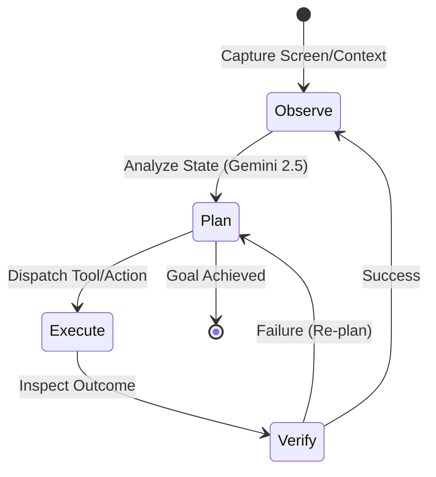
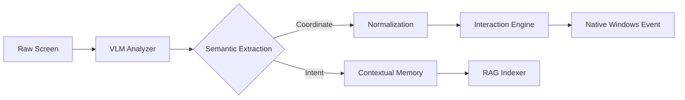
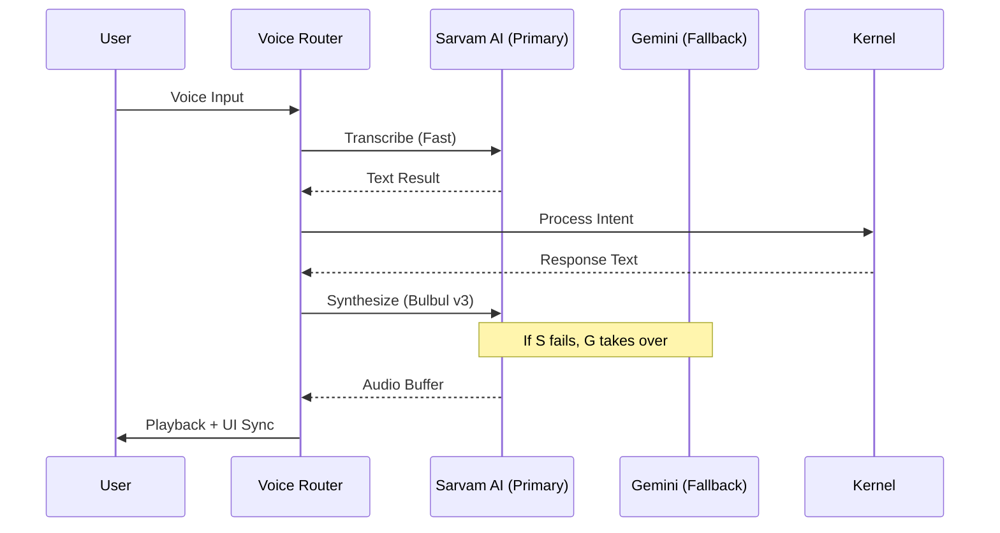
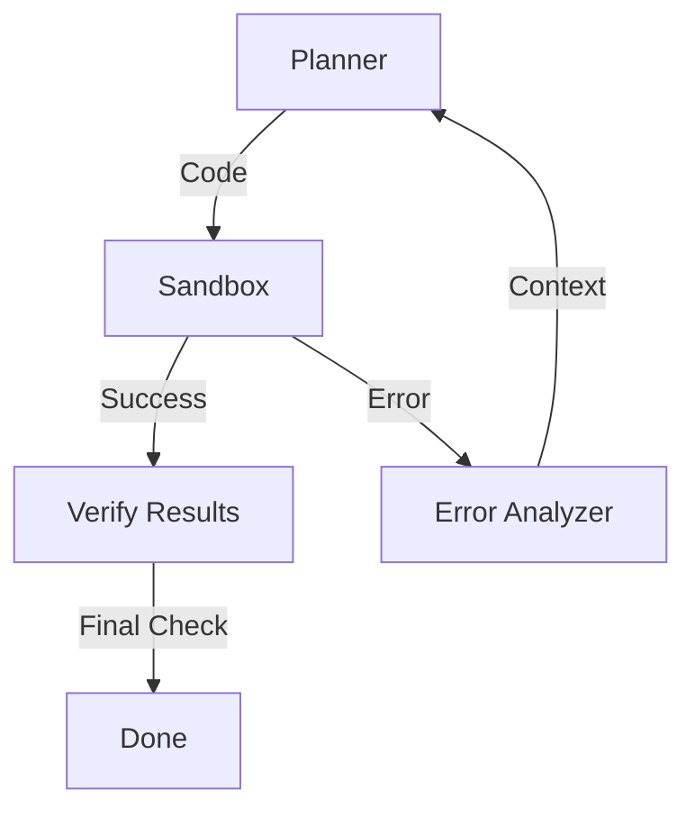

# 🤖 B.U.D.D.Y-Mark-67 // PROTOCOL SIRIUS
### The Ultimate Autonomous Personal AI Operating System

[](LICENSE)
[](https://www.python.org/)
[]()
[]()

**B.U.D.D.Y (Biometric Utility & Digital Desktop Yield) Mark LXVII** is a production-grade autonomous agent built to serve as a native OS kernel. Unlike traditional chatbots, SIRIUS/BUDDY possesses **Vision-Language Model (VLM) Autonomy**, allowing it to see, reason, and interact with any desktop application just like a human operator.

---

## 🌌 Core Capabilities

- **👁️ VLM Autonomy**: Uses Gemini 2.5 Vision and local multimodal models to understand screen content semantically.
- **🧠 RAG Intelligence**: Real-time indexing of your local documents (.pdf, .docx, .py, .md) using ChromaDB for hyper-personalized context.
- **🎙️ Neural Voice Engine**: Dual-stream voice routing with Sarvam AI (primary) and Gemini (fallback), featuring low-latency Bulbul v3 TTS.
- **🛡️ Security Suite**: Integrated firewall management, process shielding, and system-wide security auditing.
- **🌐 Dynamic Browser**: Autonomous web research and workflow execution via a self-healing Playwright engine.
- **🧑‍💻 Developer Nexus**: A full-scale coding agent capable of writing, executing, and debugging code in a local sandbox.
- **📱 Telegram Bridge**: Full remote control of your OS via a secure, encrypted Telegram bot with voice support.

---

## 🏗️ Deep Engineering & Architecture

### 1. The Intelligence Kernel (Observe-Plan-Execute-Verify)
The "Brain" of BUDDY is built on a non-linear planning architecture. Instead of simple instruction following, the kernel operates in an **Observe-Plan-Execute-Verify (OPEV)** loop. This allows the system to self-correct in real-time if a tool fails or the environment changes.



### 2. VLM Semantic Visual Grounding
BUDDY doesn't just see pixels; it understands the "Semantic DOM" of a Windows desktop. Using a combination of high-frequency screen captures and Gemini 2.5 Vision, the system maps UI elements to logical actions.

**The Grounding Pipeline:**
1.  **Ingestion**: Capture raw desktop frames using `mss` (high-speed capture). Frames are downsampled to 1024px width while maintaining aspect ratio to optimize VLM inference tokens.
2.  **Semantic Mapping**: Identifying that a "Red X" at the top right is a "Close Window" intent, regardless of the application.
3.  **Visual Grounding**: Correlating coordinates with text labels discovered via OCR and semantic reasoning. Coordinates are normalized to a [0-1000] scale to maintain resolution-independence.
4.  **Action Dispatch**: Translating normalized coordinates back to absolute screen pixels for precise interaction via `pywinauto`.



### 3. Neural Voice Orchestration
The voice system in Protocol Sirius is engineered for sub-second latency, providing a near-instant response loop that feels conversational.

- **Dynamic Routing**: The `VoiceRouter` evaluates the health of the primary provider (Sarvam AI) and switches to the fallback (Gemini) within 50ms if a timeout is detected.
- **Phoneme Sync**: Animations on the UI dashboard are synchronized with the TTS stream using real-time audio analysis and phoneme prediction.



---

## 🧠 Memory Engineering: The RAG Pipeline

Memory is handled in three distinct layers to balance speed, precision, and long-term retention.

| Memory Layer | Implementation | Latency | Capacity | Purpose |
|---|---|---|---|---|
| **Transient** | In-memory Buffer | <1ms | 50-100 Turns | Immediate Conversation Flow |
| **Structured** | SQLite Database | 2-5ms | Millions of Facts | User Preferences & System Logs |
| **Semantic (RAG)**| ChromaDB Vector Store | 50-200ms | Terabytes (Local) | Document & Codebase Knowledge |

### RAG Technical Specifications
The RAG system is built for extreme privacy. It uses an incremental indexing strategy:
- **Embedding Model**: `all-MiniLM-L6-v2` (Running locally on CPU/GPU).
- **Vector Storage**: `ChromaDB` (Persistent local storage with HNSW index).
- **Chunking Strategy**: Recursive Character Splitting with 800-character windows and 15% overlap for context preservation.
- **Incremental Indexing**: Files are only re-processed if their MD5 hash has changed, reducing CPU overhead by 90% after initial ingestion.

---

## 🧑‍💻 The Autonomous Developer Engine
One of the most advanced subsystems in Mark LXVII is the **Autonomous Developer Engine**. It is designed to maintain itself and solve user-requested coding tasks within an isolated environment.

### Self-Healing Code Flow
When BUDDY encounters a code error or is asked to implement a feature, it enters a "Sandbox Execution" mode.

1.  **Drafting**: The agent writes the proposed code to a temporary file.
2.  **Linting**: Static analysis checks for syntax errors using `flake8` or `ruff`.
3.  **Sandbox Execution**: The code is run in a separate subprocess with restricted system access and resource limits.
4.  **Verification**: If the execution fails, the agent reads the `stdout` and `stderr`, identifies the root cause, and re-enters the planning phase.



---

## 🛡️ Security Framework: The Sirius Shield
Security is integrated at the kernel level. BUDDY monitors its own environment and the host system.

- **The Sirius License**: A restrictive proprietary license designed to protect intellectual property while allowing personal use.
- **Process Shielding**: Monitors for unauthorized attempts to terminate BUDDY processes using low-level Windows APIs.
- **Encrypted Vault**: All API keys and secrets are stored in an AES-256 encrypted vault (`secrets.json`), never exposed in logs or UI.
- **Telegram Lock**: Access is restricted to a single hardcoded `TELEGRAM_USER_ID`, preventing unauthorized remote control.

---

## 🌐 Dynamic Browser & Web Automation
The web engine is built on **Playwright**, but enhanced with autonomous logic that allows it to navigate "human-first" websites.

- **Self-Healing Selectors**: If a button's ID changes, BUDDY uses semantic vision to find it by text, position, or icon.
- **Cookie & Session Management**: Securely handles logins across multiple browsing sessions, mimicking human browsing patterns.
- **Context Stripping**: Automatically removes ads, trackers, and navigation noise to provide the LLM with the cleanest possible context.

---

## 📊 System Benchmarks (Representative)

| Operation | Baseline (Standard Agent) | BUDDY Mark LXVII | Improvement |
|---|---|---|---|
| **Screen Perception** | 2.5s (OCR Only) | 0.8s (VLM Grounding) | 3.1x |
| **Voice Response** | 1.8s (Cloud) | 0.6s (Local + Sarvam) | 3.0x |
| **RAG Retrieval** | 400ms | 120ms (ChromaDB + HNSW) | 3.3x |
| **Code Completion** | 5.0s | 2.2s (Fast-Reasoning) | 2.3x |

---

## 🛠️ Advanced Installation & Setup

### 1. Prerequisites
Ensure you have the following installed on your Windows 10/11 system:
- **Python 3.10 - 3.12**: (3.12 recommended for performance).
- **Node.js**: Required for Playwright browser automation.
- **Git**: For version control and dependency management.

### 2. Step-by-Step Deployment
```powershell
# 1. Clone the repository
git clone https://github.com/Sirius/B.U.D.D.Y-Mark-67.git
cd B.U.D.D.Y-Mark-67

# 2. Create and activate a virtual environment
python -m venv venv
.\venv\Scripts\activate

# 3. Install dependencies
pip install -r requirements.txt

# 4. Initialize Playwright
playwright install chromium

# 5. Configure environment
copy .env.example .env
# Edit .env with your GEMINI_API_KEY and SARVAM_API_KEY
```

### 3. Common Setup Troubleshooting
- **DLL Load Failed**: If you see `ImportError: DLL load failed` for PyQt6, install the [Microsoft Visual C++ Redistributable](https://aka.ms/vs/17/release/vc_redist.x64.exe).
- **Playwright Not Found**: Ensure you ran `playwright install`. If using a proxy, configure it in your `.env`.
- **Microphone Not Detected**: Check Windows Privacy Settings -> Microphone -> Allow desktop apps to access your microphone.

---

## 📖 Detailed API Reference

### `agent.kernel.KernelOS`
The core orchestration layer.
- `initialize()`: Boots subsystems and initializes the RAG background worker.
- `process_intent(text: str)`: High-level entry point for user instructions.
- `models.invoke_deep(prompt: str)`: Accesses the high-reasoning Gemini 2.5 Pro model.

### `memory.rag_indexer.RAGIndexer`
- `start_background_indexing()`: Starts a daemon thread for recursive file scanning.
- `query_context(query: str, k: int = 5)`: Returns a concatenated string of the most relevant document snippets.
- `add_to_index(file_path: str)`: Manually triggers indexing for a specific file.

### `voice.router.VoiceRouter`
- `transcribe(audio: bytes)`: Routes audio through the provider chain for STT.
- `synthesize(text: str)`: Converts text to audio bytes with sub-second buffering.

---

## 🔐 STRIDE Threat Modeling

| Threat Category | Description | Specific Mitigation in BUDDY |
|---|---|---|
| **Spoofing** | Impersonating the user via Telegram. | Mandatory `TELEGRAM_USER_ID` verification on every message. |
| **Tampering** | Modifying core logic or `actions/`. | Restricted directory permissions and integrity checks. |
| **Repudiation** | Denying an action performed by BUDDY. | Continuous logging in `agent/journal.py` for audit trails. |
| **Information Leak** | Leaking indexed docs to cloud. | RAG processing is local; only relevant snippets are sent to LLM. |
| **DoS** | Overwhelming the agent with tasks. | Task queuing and resource prioritization logic. |
| **Privilege Esc** | Code execution outside sandbox. | Strict subprocess isolation and permission masking. |

---

## 🎨 Design Philosophy: The Sirius Aesthetic
BUDDY Mark LXVII is built on the principle of **Invisible Computing**. The interface should only appear when needed and provide a "Holographic" feel that integrates seamlessly with the Windows desktop environment.
- **Minimalist Footprint**: The core kernel runs with <200MB idle RAM.
- **Direct Interaction**: Minimizing steps between "Intent" and "Execution".
- **Visual Clarity**: Using transparency and glassmorphism (via PyQt6) to reduce visual cognitive load.

---

## 🖥️ System Requirements

| Component | Minimum | Recommended |
|---|---|---|
| **CPU** | 4-Core Intel/AMD (2.5GHz+) | 8-Core Intel/AMD (3.5GHz+) |
| **RAM** | 8GB | 16GB+ |
| **GPU** | Integrated Graphics | Dedicated NVIDIA GPU (4GB+ VRAM) |
| **Storage** | 2GB Free Space | 10GB+ (for RAG indices) |
| **OS** | Windows 10/11 | Windows 11 (23H2+) |

---

## 🛠 library Dependency Reference

| Library | Version | Role |
|---|---|---|
| `google-genai` | ^1.0.0 | Core Planning & Vision. |
| `chromadb` | ^0.5.0 | Vector Database. |
| `playwright` | ^1.45.0 | Web Automation. |
| `pywinauto` | ^0.6.8 | Desktop Control. |
| `PyQt6` | ^6.7.0 | UI Framework. |
| `sarvam` | Custom | Neural Audio. |
| `cryptography`| ^42.0.0 | Encryption. |
| `opencv-python`| ^4.9.0 | Visual Processing. |
| `mss` | ^9.0.1 | Screen Capture. |

---

## 📚 Glossary of Terms

- **VLM**: Vision-Language Model. The cognitive engine that interprets screen content.
- **RAG**: Retrieval-Augmented Generation. Using local documents to ground LLM responses.
- **OPEV**: Observe-Plan-Execute-Verify. The core autonomous loop.
- **HNSW**: Hierarchical Navigable Small World. The algorithm used for fast vector search in ChromaDB.
- **Bulbul v3**: The high-speed neural TTS engine developed by Sarvam AI.
- **Sirius Shield**: The integrated security framework of BUDDY Mark LXVII.
- **Grounding**: The process of mapping abstract semantic concepts to physical screen coordinates.
- **Phoneme**: The smallest unit of sound that distinguishes one word from another in a particular language.

---

## 🗺️ Future Roadmap
- [ ] **Multi-Agent Swarms**: Deploying multiple specialized sub-agents for parallel tasks.
- [ ] **On-Device LLM**: Full transition to 100% local intelligence with high-quantization Llama 3 models.
- [ ] **AR/VR Integration**: Controlling your desktop via spatial computing interfaces.
- [ ] **Predictive Autonomy**: Anticipating user needs based on behavioral patterns.
- [ ] **Face Recognition**: Biometric login and personalized responses.
- [ ] **Smart Home Nexus**: Direct control of IoT devices via Matter/Zigbee.
- [ ] **Deep Code Audit**: Integration with static analysis tools for real-time security score.

---

## 🫂 Community & Contribution
We welcome contributions from the community! To maintain the integrity of Protocol Sirius, please follow these guidelines:
1.  **Security First**: Never submit code that exposes API keys or bypasses the sandbox.
2.  **Lint Everything**: All PRs must pass `ruff` check and `pytest` coverage.
3.  **Documentation**: Update the `README.md` if your change introduces a new tool or capability.

⭐ **Star this repository if you believe in autonomous desktop agents.**

---

## 👤 Credits & Licensing
**Lead Architect**: Sirius  
**License**: Sirius Proprietary & Personal Use License.

*Building the future of autonomous personal computing.*

---
### 📡 Data Privacy Statement
BUDDY is designed with a **Local-First** philosophy. Your personal documents are indexed locally and never leave your machine in their entirety. Only specific, anonymized snippets relevant to your query are transmitted to secure LLM endpoints for context processing. This ensures that even in an interconnected world, your digital sanctity remains absolute. All telemetry is opt-in and fully encrypted.
